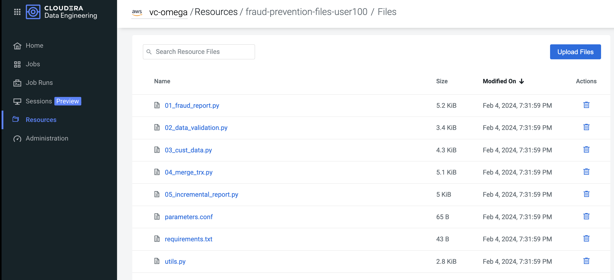
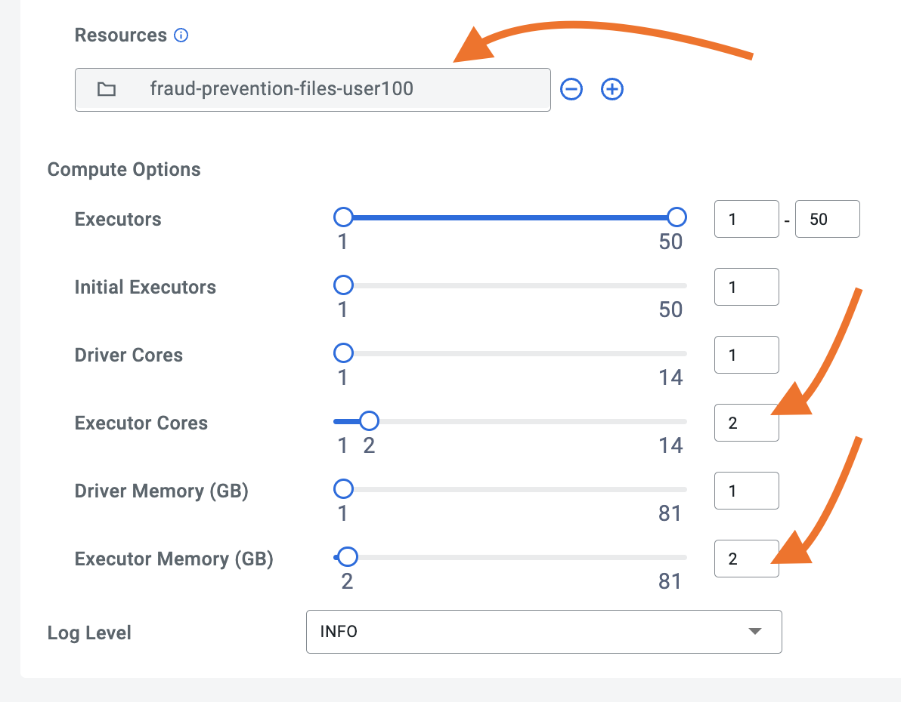
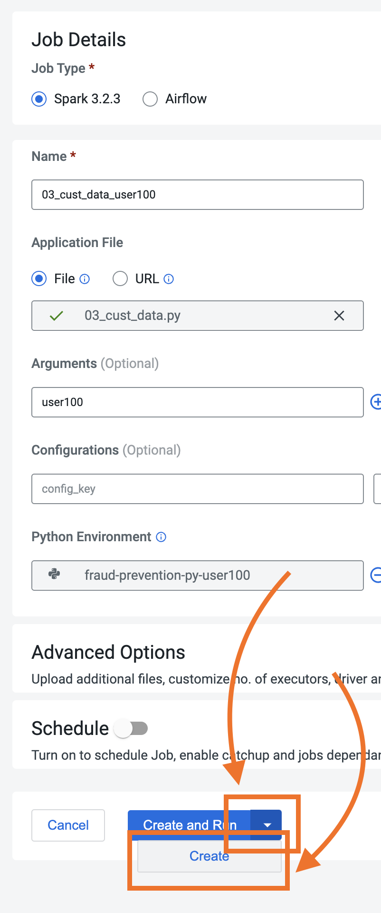

# Part 3: Apache Airflow in CDE

* [A Brief Introduction to Apache Airflow](https://github.com/pdefusco/CDE_Banking_HOL_MKT/blob/main/step_by_step_guides/english/part_03_airflow.md#a-brief-introduction-to-airflow)
* [Lab 1: Orchestrate Spark Pipeline with Airflow](https://github.com/pdefusco/CDE_Banking_HOL_MKT/blob/main/step_by_step_guides/english/part_03_airflow.md#lab-1-orchestrate-spark-pipeline-with-airflow)
* [Summary](https://github.com/pdefusco/CDE_Banking_HOL_MKT/blob/main/step_by_step_guides/english/part_03_airflow.md#summary)
* [Useful Links and Resources](https://github.com/pdefusco/CDE_Banking_HOL_MKT/blob/main/step_by_step_guides/english/part_03_airflow.md#useful-links-and-resources)

### A Brief Introduction to Airflow

Apache Airflow is a platform to author, schedule and execute Data Engineering pipelines. It is widely used by the community to create dynamic and robust workflows for batch Data Engineering use cases.

The main characteristic of Airflow workflows is that all workflows are defined in Python code. The Python code defining the worflow is stored as a collection of Airflow Tasks organized in a DAG. Tasks are defined by built-in opearators and Airflow modules. Operators are Python Classes that can be instantiated in order to perform predefined, parameterized actions.

CDE embeds Apache Airflow at the CDE Virtual Cluster level. It is automatically deployed for the CDE user during CDE Virtual Cluster creation and requires no maintenance on the part of the CDE Admin. In addition to the core Operators, CDE supports the CDEJobRunOperator and the CDWOperator in order to trigger Spark Jobs. and Datawarehousing queries.

### Lab 3: Create CDE Resources and Run CDE Spark Job

Up until now you used Sessions to interactively explore data. CDE also allows you to run Spark Application code in batch with as a CDE Job. There are two types of CDE Jobs: Spark and Airflow. In this lab we will create a CDE Spark Job and revisit Airflow later in part 3.

The CDE Spark Job is an abstraction over the Spark Submit. With the CDE Spark Job you can create a reusable, modular Spark Submit definition that is saved in CDE and can be modified in the CDE UI (or via the CDE CLI and API) before every run according to your needs. CDE stores the job definition for each run in the Job Runs UI so you can go back and refer to it long after your job has completed.

Furthermore, CDE allows you to directly store artifacts such as Python files, Jars and other dependencies, or create Python environments and Docker containers in CDE as "CDE Resources". Once created in CDE, Resources are available to CDE Jobs as modular components of the CDE Job definition which can be swapped and referenced by a particular job run as needed.

These features dramatically reduce the amount of work and effort normally required to manage and monitor Spark Jobs in a Spark Cluster. By providing a unified view over all your runs along with the associated artifacts and dependencies, CDE streamlines CI/CD pipelines and removes the need for glue code in your Spark cluster.

In the next steps we will see these benefits in actions.

##### Create CDE Python Resource

Navigate to the Resources tab and create a Python Resource. Make sure to select the Virtual Cluster assigned to you if you are creating a Resource from the CDE Home Page, and to name the Python Resource after your username e.g. "fraud-prevention-py-user100" if you are "user100".

Upload the "requirements.txt" file located in the "cde_spark_jobs" folder. This can take up to a few minutes.

Please familiarize yourself with the contents of the "requirements.txt" file and notice that it contains a few Python libraries such as Pandas and PyArrow.

Then, move on to the next section even while the environment build is still in progress.

##### Create CDE Files Resource

From the Resources page create a CDE Files Resource. Upload all files contained in the "cde_spark_jobs" folder. Again, ensure the Resource is named after your unique workshop username and it is created in the Virtual Cluster assigned to you.

Before moving on to the next step, please familiarize yourself with the code in the "01_fraud_report.py", "utils.py", and "parameters.conf" files.

Notice that "01_fraud_report.py" contains the same PySpark Application code you ran in the CDE Session, with the exception that the column casting and renaming steps have been refactored into Python functions in the "utils.py" script.

Finally, notice the contents of "parameters.conf". Storing variables in a file in a Files Resource is one method used by CDE Data Engineers to dynamically parameterize scripts with external values.

##### Create CDE Spark Job

Now that the CDE Resources have been created you are ready to create your first CDE Spark Job.

Navigate to the CDE Jobs tab and click on "Create Job". The long form loaded to the page allows you to build a Spark Submit as a CDE Spark Job, step by step.

Enter the following values without quotes into the corresponding fields. Make sure to update the username with your assigned user wherever needed:

* Job Type: Spark
* Name: 01_fraud_report_userxxx
* File: Select from Resource -> "01_fraud_report.py"
* Arguments: userxxx
* Configurations:
  - key: spark.sql.autoBroadcastJoinThreshold
  - value: 11M

The form should now look similar to this:

Finally, open the "Advanced Options" section.

Notice that your CDE Files Resource has already been mapped to the CDE Job for you.

Then, update the Compute Options by increasing "Executor Cores" and "Executor Memory" from 1 to 2.

Finally, run the CDE Job by clicking the "Create and Run" icon.

##### CDE Job Run Observability

Navigate to the Job Runs page in your Virtual Cluster and notice a new Job Run is being logged automatically for you.

Once the run completes, open the run details by clicking on the Run ID integer in the Job Runs page.

Open the logs tab and validate output from the Job Run in the Driver -> Stdout tab.

### Lab 4: Orchestrate Spark Pipeline with Airflow

In this lab you will build a pipeline of Spark Jobs to load a new batch of transactions, join it with customer PII data, and create a report of customers who are likely victims of credit card fraud.

At a high level, the workflow will be similar to Part 1 and 2 where you created two tables and loaded a new batch of transactions. However, there are two differences:

1. The workflow will leverage all the features used up to this point but in unison. For example, Iceberg Time Travel will be used to create an incremental report including only updates within the latest batch rather than the entire historical dataset.
2. The entire workflow will be orchestrated by Airflow. This will allow you to run your jobs in parallel while implementing robust error handling logic.

##### Create Spark Jobs

In this section you will create four CDE Spark Jobs via the CDE Jobs UI. It is important that you ***do not run the Spark Jobs when you create them***. If you do run them by mistake, please raise your hand during the workshop and ask for someone to help you implement a workaround.

1. Lakehouse Bronze:
  - Name: name this after your user e.g. if you are user "user010" call it "03_cust_data_user010"
  - Application File: "03_cust_data.py" located in your CDE Files resource.
  - Arguments: enter your username here, without quotes (just text) e.g. if you are user "user010" enter "user010" without quotes
  - Python Environment: choose your CDE Python resource from the dropdown
  - Files & Resources: choose your CDE Files resource from the dropdown (this should have already been prefilled for you)
  - Leave all other settings to default values and create the job.

2. Lakehouse Silver:
  - Name: name this after your user e.g. if you are user "user010" call it "04_merge_trx_user010"
  - Application File: "04_merge_trx.py" located in your CDE Files resource.
  - Arguments: enter your username here, without quotes (just text) e.g. if you are user "user010" enter "user010" without quotes
  - Files & Resources: choose your CDE Files resource from the dropdown (this should have already been prefilled for you)
  - Leave all other settings to default values and create the job.  

3. Lakehouse Gold:
  - Name: name this after your user e.g. if you are user "user010" call it "05_inc_report_user010"
  - Application File: "05_incremental_report.py" located in your CDE Files resource.
  - Arguments: enter your username here, without quotes (just text) e.g. if you are user "user010" enter "user010" without quotes
  - Files & Resources: choose your CDE Files resource from the dropdown (this should have already been prefilled for you)
  - Leave all other settings to default values and create the job.  

##### Create Airflow Job

Open the "airflow_dag.py" script located in the "cde_airflow_jobs" folder. Familiarize yourself with the code an notice:

* The Python classes needed for the DAG Operators are imported at the top. Notice the CDEJobRunOperator is included to run Spark Jobs in CDE.
* The "default_args" dictionary includes options for scheduling, setting dependencies, and general execution.
* Four instances of the CDEJobRunOperator obect is declared with the following arguments:
  - Task ID: This is the name used by the Airflow UI to recognize the node in the DAG.
  - DAG: This has to be the name of the DAG object instance declared at line 16.
  - Job Name: This has to be the name of the Spark CDE Job created in step 1 above.
* Finally, at the bottom of the DAG, Task Dependencies are declared. With this statement you can specify the execution sequence of DAG tasks.

Edit the username variable at line 49. Then navigate to the CDE Jobs UI and create a new CDE Job.

Select Airflow as the Job Type, assign a unique CDE Job name based on your user, and then run the Job.  

Monitor the execution of the pipeline from the Job Runs UI. Notice an Airflow Job will be triggered and successively the four CDE Spark Jobs will run one by one.

While the job is in-flight open the Airflow UI and monitor execution.

### Summary

{more on spark jobs in CDE}

In the process, you improved your code for reusability by modularizing your logic into functions, and stored those functions as a utils script in a CDE Files Resource. You also leveraged your Files Resource by storing dynamic variables in a parameters configurations file and applying a runtime variable via the Arguments field. In the context of more advanced Spark CI/CD pipelines both the parameters file and the Arguments field can be overwritten and overridden at runtime.

In order to improve performance you translated the PySpark UDF into a Pandas UDF. You created a CDE Python Resource and attached it to the CDE Job Definition in order to use Pandas and other Python libraries in your PySpark job.

Finally, you ran the job and observed outputs in the CDE Job Runs page. CDE stored Job Runs, logs, and associated CDE Resources for each run. This provided you real time job monitoring and troubleshooting capabilities, along with post-execution storage of logs, run dependencies, and cluster information.

Each CDE virtual cluster includes an embedded instance of Apache Airflow. With Airflow based pipelines users can specify their Spark pipeline using a simple python configuration file called the Airflow DAG.

A basic CDE Airflow DAG can be composed of a mix of hive and spark operators that automatically run jobs on CDP Data Warehouse (CDW) and CDE, respectively; with the underlying security and governance provided by SDX.

### Useful Links and Resources

* [Working with CDE Files Resources](https://community.cloudera.com/t5/Community-Articles/Working-with-CDE-Files-Resources/ta-p/379891)
* [Efficiently Monitoring Jobs, Runs, and Resources with the CDE CLI](https://community.cloudera.com/t5/Community-Articles/Efficiently-Monitoring-Jobs-Runs-and-Resources-with-the-CDE/ta-p/379893)
* [Working with CDE Spark Job Parameters in Cloudera Data Engineering](https://community.cloudera.com/t5/Community-Articles/Working-with-CDE-Spark-Job-Parameters-in-Cloudera-Data/ta-p/380792)
* [How to parse XMLs in CDE with the Spark XML Package](https://community.cloudera.com/t5/Community-Articles/How-to-parse-XMLs-in-Cloudera-Data-Engineering-with-the/ta-p/379451)
* [Spark Geospatial with Apache Sedona in CDE](https://community.cloudera.com/t5/Community-Articles/Spark-Geospatial-with-Apache-Sedona-in-Cloudera-Data/ta-p/378086)
* [Automating Data Pipelines Using Apache Airflow in CDE](https://docs.cloudera.com/data-engineering/cloud/orchestrate-workflows/topics/cde-airflow-dag-pipeline.html)
* [Using CDE Airflow](https://github.com/pdefusco/Using_CDE_Airflow)
* [Airflow DAG Arguments Documentation](https://airflow.apache.org/docs/apache-airflow/stable/tutorial.html#default-arguments)
* [Exploring Iceberg Architecture](https://github.com/pdefusco/Exploring_Iceberg_Architecture)
* [Enterprise Data Quality at Scale in CDE with Great Expectations and CDE Custom Runtimes](https://community.cloudera.com/t5/Community-Articles/Enterprise-Data-Quality-at-Scale-with-Spark-and-Great/ta-p/378161)
