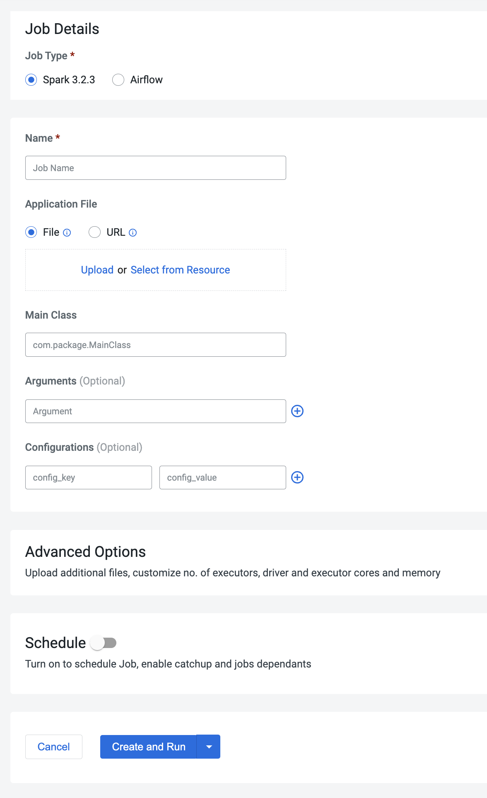
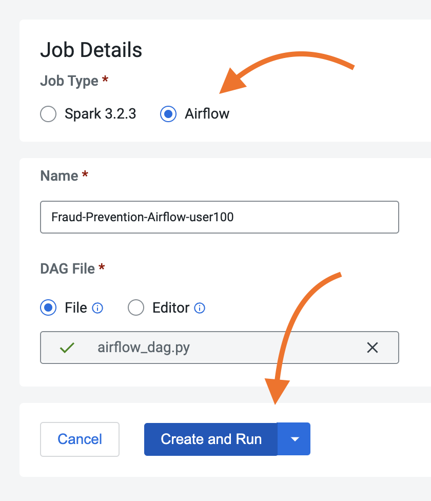

# Job Deployment & Orchestration

* [A Brief Introduction to Apache Airflow](https://github.com/pdefusco/CDE_Banking_HOL_MKT/blob/main/step_by_step_guides/english/part_03_airflow.md#a-brief-introduction-to-airflow)
* [Lab 1: Orchestrate Spark Pipeline with Airflow](https://github.com/pdefusco/CDE_Banking_HOL_MKT/blob/main/step_by_step_guides/english/part_03_airflow.md#lab-1-orchestrate-spark-pipeline-with-airflow)
* [Summary](https://github.com/pdefusco/CDE_Banking_HOL_MKT/blob/main/step_by_step_guides/english/part_03_airflow.md#summary)
* [Useful Links and Resources](https://github.com/pdefusco/CDE_Banking_HOL_MKT/blob/main/step_by_step_guides/english/part_03_airflow.md#useful-links-and-resources)


### Lab 3: Create CDE Resources and Run CDE Spark Job

Up until now you used Sessions to interactively explore data. CDE also allows you to run Spark Application code in batch as a CDE Job. There are two types of CDE Jobs: Spark and Airflow. In this lab we will create an Airflow Job in order to orchestrate three Spark Jobs.

The CDE Spark Job is an abstraction over the Spark Submit. With the CDE Spark Job you can create a reusable, modular Spark Submit definition that is saved in CDE and can be modified in the CDE UI (or via the CDE CLI and API) before every run according to your needs. CDE stores the job definition for each run in the Job Runs UI so you can go back and refer to it long after your job has completed.

Furthermore, CDE allows you to directly store artifacts such as Python files, Jars and other dependencies, or create Python environments and Docker containers in CDE as "CDE Resources". Once created in CDE, Resources are available to CDE Jobs as modular components of the CDE Job definition which can be swapped and referenced by a particular job run as needed.

These features dramatically reduce the amount of effort otherwise required in order to manage and monitor Spark Jobs in a Spark Cluster. By providing a unified pane over all your runs along with a clear view of all associated artifacts and dependencies, CDE streamlines Spark cluster operations.

##### Familiarize Yourself with the Code

The Spark Application scripts and configuration files used in these labs are available at the [CDE Spark Jobs folder in the HOL git repository](https://github.com/pdefusco/CDE_121_HOL/tree/main/cde_spark_jobs). Before moving on to the next step, please familiarize yourself with the code in the "01_Lakehouse_Bronze.py", "002_Lakehouse_Silver.py", "003_Lakehouse_Gold.py", "utils.py",  "parameters.conf" files.

The Airflow DAG script is available in the [CDE Airflow Jobs folder in the HOL git repository](https://github.com/pdefusco/CDE_121_HOL/tree/main/cde_airflow_jobs). Please familiarize yourself with the code in the "airflow_dag.py" script as well.

* The "01_Lakehouse_Bronze.py" PySpark Application createas an Iceberg customer table from a CSV file and provides a few examples of Iceberg Schema evolution transformations; then it loads the raw transactions batch into a PySpark dataframe and then writes the data into the Transactions table through an Iceberg Table Branch named "ingestion_branch". Notice that, similarly to the CDE Session earlier, a "castMultipleColumns" method is used to transform multiple columns at once. However, this time the Python method is stored in the "utils.py" script in a CDE Files Resource and is loaded as a job dependency.

* The "utils.py" contains a the Python method to transform multiple dataframe columns at once utilized by the "01_Lakehouse_Bronze.py" script.

* The "parameters.conf" contains a configuration variable that is passed to each of the three PySpark scripts. Storing variables in a Files Resource is a commonly used method by CDE Data Engineers to dynamically parameterize scripts and pass hidden credentials at runtime.

* The "02_Lakehouse_Silver.py" PySpark Application loads the data from the Transactions table's "ingestion_branch" branch, validates it, and then uses the "cherrypick_snapshot" method in order to merge the "ingestion_branch" branch with the main table branch in order to update the current state of the table.

* The "03_Lakehouse_Gold.py" PySpark Application loads the data from the Customers and Transactions tables, joins it and by means of a PySpark UDF provides the distance between the transaction and home location of the customer. Notice that the Transactions table is filtered with two Iceberg Snapshots. In other words, only the data loaded in between the table operations defined by the two snapshots is selected. Finally, a selection of columns from the joined dataframes is stored as a new Iceberg Table which will serve as the Gold layer in the Lakehouse. That is to say, this is the table that scheduled reports and BI Analysts will routinely query in order to complete their reporting tasks.

* The "airflow_dag.py" Airflow DAG orchestrates a Data Engineering pipeline. First an AWS S3 bucket is created; a simple file "my_file.txt" is read from a CDE Files Resource and written to the S3 bucket. Successively the three CDE Spark Jobs discussed above are executed to transform and join customer transactions and PII data and create a Lakehouse Gold Layer table. Finally, the S3 bucket is deleted. The steps above are achieved with a combination of Airflow and Cloudera Open Source Operators.

##### Create CDE Repository

Git repositories allow teams to collaborate, manage project artifacts, and promote applications from lower to higher environments. CDE supports integration with Git providers such as GitHub, GitLab, and Bitbucket to synchronize job runs with different versions of your code.

In this step you will create a CDE Repository in order to clone the PySpark scripts containing the Application Code for your CDE Spark Job.

From the Main Page click on "Repositories" and then the "Create Repository" blue icon. 


Use the following parameters for the form:

```
Repository Name: CDE_Repo_userxxx
URL: https://github.com/pdefusco/CDE_121_HOL.git
Branch: main
```


All files from the git repository are now stored in CDE as a CDE Repository. Each participant will have their own CDE repository.


##### Create CDE Files Resource

A resource in CDE is a named collection of files used by a job or a session. Resources can include application code, configuration files, custom Docker images, and Python virtual environment specifications (requirements.txt).

A CDE Resource of type "Files" containing the the "parameters.conf" and "utils.py" files has already been created for all participants.

##### Create CDE Spark Job

Now that the CDE Resources have been created you are ready to create your first CDE Spark Job.

Navigate to the CDE Jobs tab and click on "Create Job". The long form loaded to the page allows you to build a Spark Submit as a CDE Spark Job, step by step.



Enter the following values without quotes into the corresponding fields. Make sure to update the username with your assigned user wherever needed:

* Job Type: Spark
* Name: 001_Lakehouse_Bronze.py
* File: Select from Resource -> "001_Lakehouse_Bronze.py"
* Arguments: userxxx #e.g. user002

The form should now look similar to this:


Finally, open the "Advanced Options" section. Notice that your CDE Files Resource has already been mapped to the CDE Job for you.

Then, update the Compute Options by increasing "Executor Cores" and "Executor Memory" from 1 to 2.


Finally, save the CDE Job by clicking the "Create" icon.

Repeat the process for the two remaining PySpark scripts:

Lakehouse Silver Spark Job:

* Job Type: Spark
* Name: 002_Lakehouse_Silver.py
* File: Select from Resource -> "002_Lakehouse_Silver.py"
* Arguments: userxxx #e.g. user002

Lakehouse Gold Spark Job:

* Job Type: Spark
* Name: 003_Lakehouse_Gold.py
* File: Select from Resource -> "003_Lakehouse_Gold.py"
* Arguments: userxxx #e.g. user002

Again, please create but do not run the jobs!


### Lab 4: Orchestrate Spark Pipeline with Airflow

In this lab you will build a pipeline of Spark Jobs to load a new batch of transactions, join it with customer PII data, and create a table of customers who are likely victims of credit card fraud including their email address and name. The entire workflow will be orchestrated by Apache Airflow.

### A Brief Introduction to Airflow

Apache Airflow is a platform to author, schedule and execute Data Engineering pipelines. It is widely used by the community to create dynamic and robust workflows for batch Data Engineering use cases.

The main characteristic of Airflow workflows is that all workflows are defined in Python code. The Python code defining the worflow is stored as a collection of Airflow Tasks organized in a DAG. Tasks are defined by built-in opearators and Airflow modules. Operators are Python Classes that can be instantiated in order to perform predefined, parameterized actions.

CDE embeds Apache Airflow at the CDE Virtual Cluster level. It is automatically deployed for the CDE user during CDE Virtual Cluster creation and requires no maintenance on the part of the CDE Admin. In addition to the core Operators, CDE supports the CDEJobRunOperator and the CDWOperator in order to trigger Spark Jobs. and Datawarehousing queries.

##### Create Airflow Files Resource

Just like CDE Spark Jobs, Airflow jobs can leverage CDE Files Resources in order to load files including datasets or runtime parameters. A CDE Files Resource named "airflow_dependencies" containing the "my_file.txt" has already been created for all participants.

##### Create Airflow Job

Open the "airflow_dag.py" script located in the "cde_airflow_jobs" folder. Familiarize yourself with the code an notice:

* The Python classes needed for the DAG Operators are imported at the top. Notice the CDEJobRunOperator is included to run Spark Jobs in CDE.
* The "default_args" dictionary includes options for scheduling, setting dependencies, and general execution.
* Three instances of the CDEJobRunOperator obect are declared. These reflect the three CDE Spark Jobs you created above.
* Finally, at the bottom of the DAG, Task Dependencies are declared. With this statement you can specify the execution sequence of DAG tasks.

***Download the file to your local machine. Edit the username variable at line 49***.

Then navigate to the CDE Jobs UI and create a new CDE Job.

Select Airflow as the Job Type; assign a unique CDE Job name based on your user; select the "airflow_dag.py" script and elect to create a new Files Resource named after yourself in the process. 

Finally, add the Files Resource dependency where you loaded "my_file.txt".  




Monitor the execution of the pipeline from the Job Runs UI. Notice an Airflow Job will be triggered and successively the three CDE Spark Jobs will run one by one.

While the job is in-flight open the Airflow UI and monitor execution.


### Summary

Cloudera Data Engineering (CDE) is a serverless service for Cloudera Data Platform that allows you to submit batch jobs to auto-scaling virtual clusters. CDE enables you to spend more time on your applications, and less time on infrastructure.

In these labs you improved your code for reusability by modularizing your logic into functions, and stored those functions as a util in a CDE Files Resource. You leveraged your Files Resource by storing dynamic variables in a parameters configurations file and applying a runtime variable via the Arguments field. In the context of more advanced Spark CI/CD pipelines both the parameters file and the Arguments field can be overwritten and overridden at runtime.

You then used Apache Airflow to not only orchestrate these three jobs, but execute them in the context of a more complex data engineering pipeline which touched resources in AWS. Thanks to Airflow's large ecosystem of open source providers, you can also operate on external and 3rd party systems.

Finally, you ran the job and observed outputs in the CDE Job Runs page. CDE stored Job Runs, logs, and associated CDE Resources for each run. This provided you real time job monitoring and troubleshooting capabilities, along with post-execution storage of logs, run dependencies, and cluster information. You will explore Monitoring and Observability in more detail in the next labs.


### Useful Links and Resources

* [Working with CDE Files Resources](https://community.cloudera.com/t5/Community-Articles/Working-with-CDE-Files-Resources/ta-p/379891)
* [Efficiently Monitoring Jobs, Runs, and Resources with the CDE CLI](https://community.cloudera.com/t5/Community-Articles/Efficiently-Monitoring-Jobs-Runs-and-Resources-with-the-CDE/ta-p/379893)
* [Working with CDE Spark Job Parameters in Cloudera Data Engineering](https://community.cloudera.com/t5/Community-Articles/Working-with-CDE-Spark-Job-Parameters-in-Cloudera-Data/ta-p/380792)
* [How to parse XMLs in CDE with the Spark XML Package](https://community.cloudera.com/t5/Community-Articles/How-to-parse-XMLs-in-Cloudera-Data-Engineering-with-the/ta-p/379451)
* [Spark Geospatial with Apache Sedona in CDE](https://community.cloudera.com/t5/Community-Articles/Spark-Geospatial-with-Apache-Sedona-in-Cloudera-Data/ta-p/378086)
* [Automating Data Pipelines Using Apache Airflow in CDE](https://docs.cloudera.com/data-engineering/cloud/orchestrate-workflows/topics/cde-airflow-dag-pipeline.html)
* [Using CDE Airflow](https://github.com/pdefusco/Using_CDE_Airflow)
* [Airflow DAG Arguments Documentation](https://airflow.apache.org/docs/apache-airflow/stable/tutorial.html#default-arguments)
* [Exploring Iceberg Architecture](https://github.com/pdefusco/Exploring_Iceberg_Architecture)
* [Enterprise Data Quality at Scale in CDE with Great Expectations and CDE Custom Runtimes](https://community.cloudera.com/t5/Community-Articles/Enterprise-Data-Quality-at-Scale-with-Spark-and-Great/ta-p/378161)
